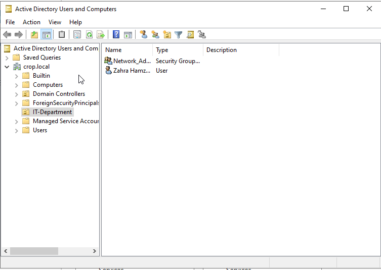
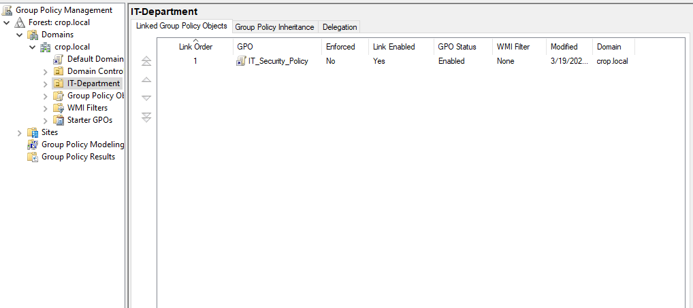
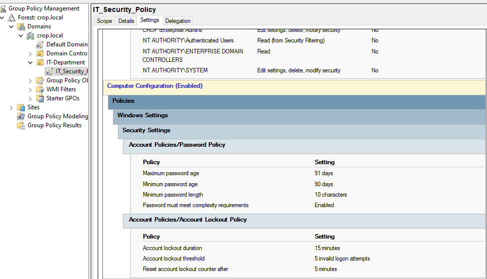

# Hybrid Infrastructure Lab

Over the years I've built and managed hybrid environments in production —
this lab is my way of keeping those skills sharp, documenting my thinking,
and experimenting with things that are harder to test on live systems.

Everything here is built from scratch. The decisions I made, the mistakes
I ran into, and the reasoning behind the architecture are all documented
as I go.

---

## Lab environment

| Component | Technology |
|-----------|-----------|
| Domain Controller | Windows Server 2022 + Active Directory |
| Virtualization | VMware vSphere (ESXi) |
| Network simulation | Cisco Packet Tracer |
| Cloud identity | Azure AD Connect |
| Backup & recovery | Azure Backup |
| Monitoring | Azure Monitor |
| Automation | Terraform |

---

## Phase 1 — Active Directory ✅

The foundation of any Windows environment. I set up a domain controller
running Windows Server 2022 with a forest called `crop.local` — structured
the way I'd do it in a real SME environment rather than just following
a tutorial.

Spent time on the OU design and group structure before touching GPO,
because getting that wrong early creates a mess that's painful to fix later.

**What I configured:**
- OU structure for the IT department
- Security group for network administrators
- User account with proper group membership
- Group Policy covering password enforcement and account lockout

On the GPO side I went with settings I've found practical in production:
10 character minimum with complexity enabled keeps things secure without
generating too many helpdesk calls, and a 15 minute lockout after 5 attempts
is aggressive enough to slow down brute force without locking out legitimate
users for hours.

### Screenshots

---

## Phase 2 — VMware vSphere (ESXi) 🔄

*In progress — setting up nested ESXi inside VirtualBox with two guest VMs*

## Phase 3 — Cisco Network Simulation 📋

*Planned — VLAN segmentation and inter-VLAN routing with Packet Tracer*

## Phase 4 — Azure Hybrid Integration 📋

*Planned — AD Connect sync, Azure Backup, and Monitor with Terraform for IaC*
